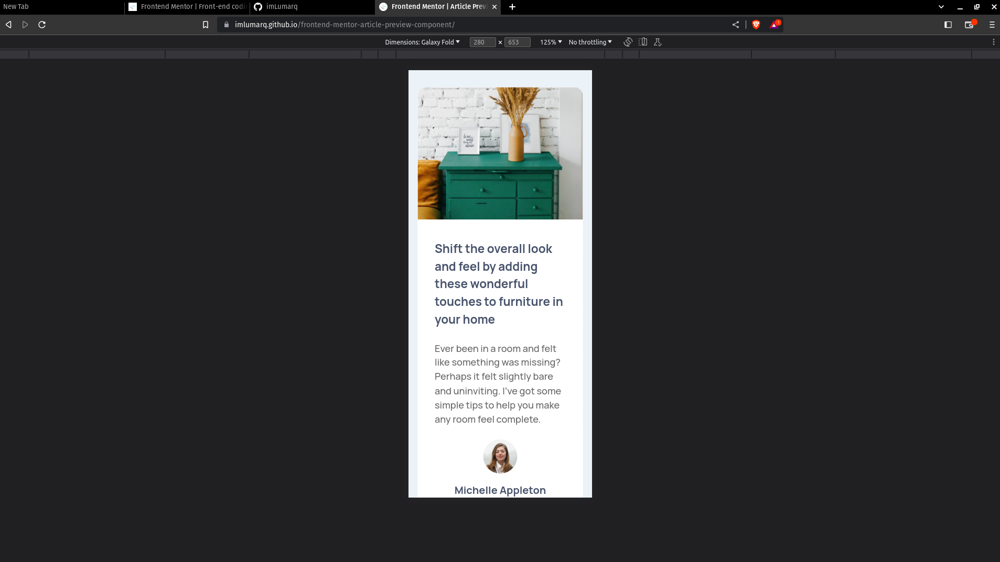
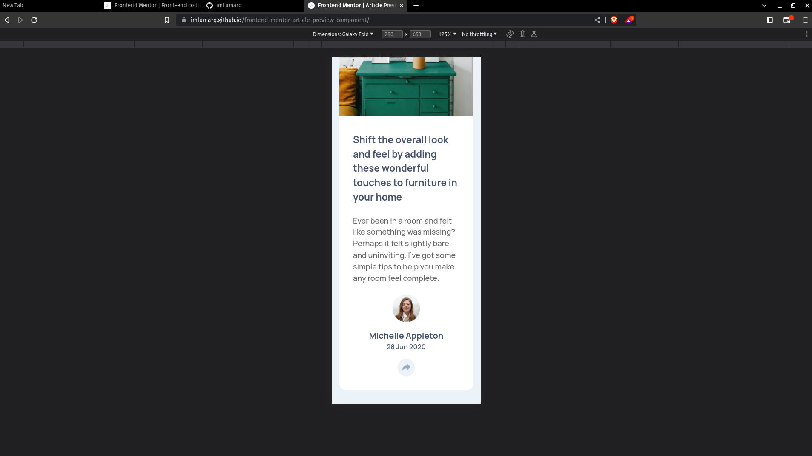
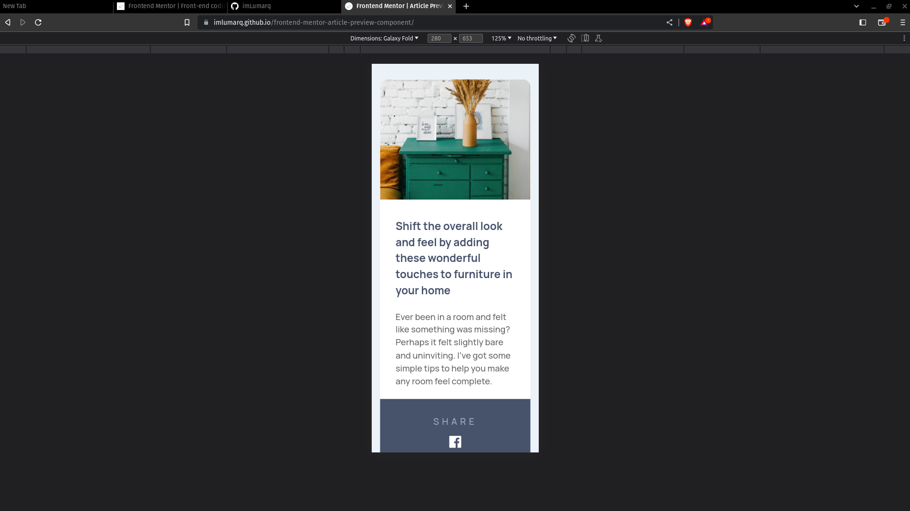
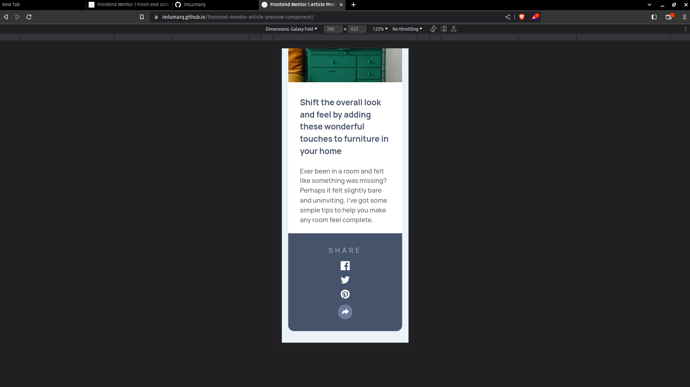
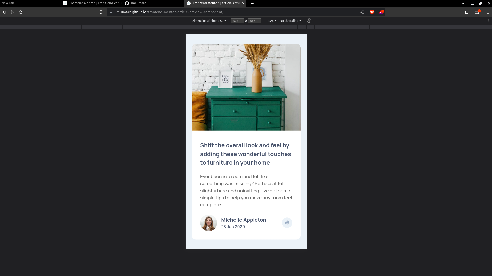
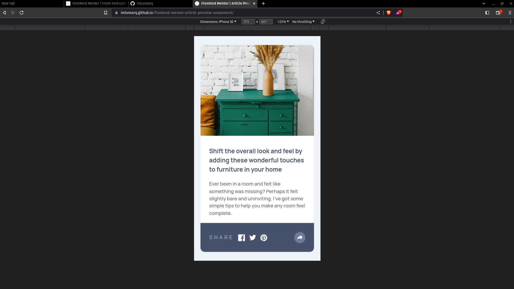
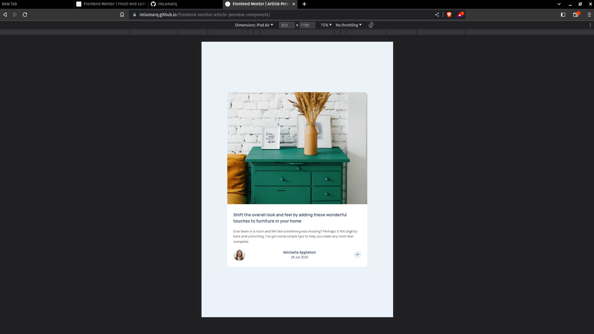
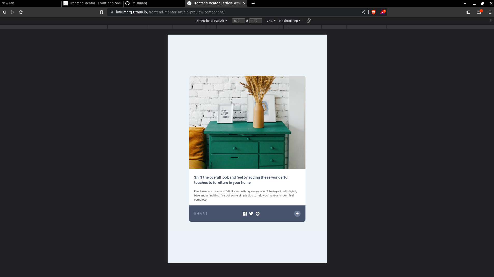
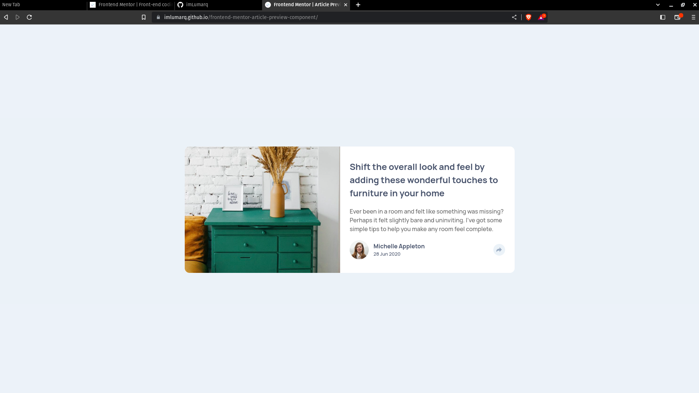
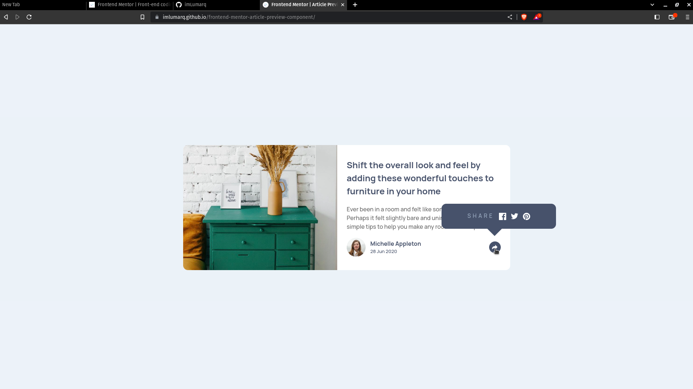

# Frontend Mentor - Article preview component solution

This is a solution to the [Article preview component challenge on Frontend Mentor](https://www.frontendmentor.io/challenges/article-preview-component-dYBN_pYFT). Frontend Mentor challenges help you improve your coding skills by building realistic projects.

## Table of contents

-   [Overview](#overview)
    -   [Screenshot](#screenshot)
    -   [Links](#links)
-   [My process](#my-process)
    -   [Built with](#built-with)
-   [Author](#author)

## Overview

### Screenshot

### Links

-   Live Site URL: (https://imlumarq.github.io/frontend-mentor-article-preview-component)
-   Github Repository: (https://github.com/imLumarq/frontend-mentor-article-preview-component)

## My process

### Built with

-   CSS custom properties
-   Semantic tags
-   Flexbox
-   Mobile-first workflow

## Author

-   Frontend Mentor - [@imLumarq](https://www.frontendmentor.io/profile/imLumarq)
